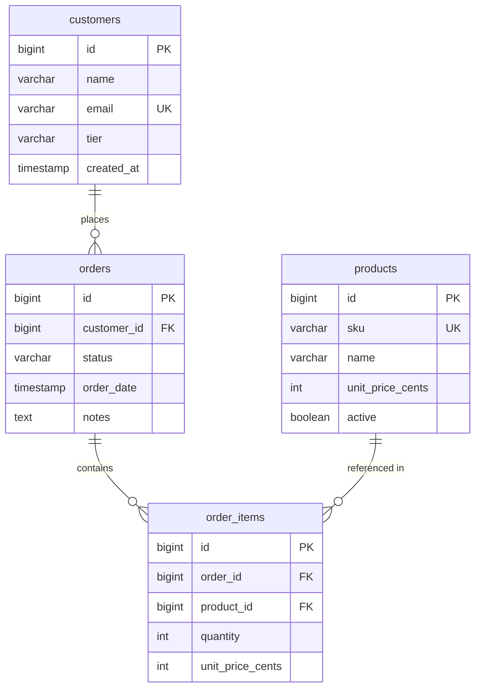

# Locked Decisions for Story 1e9b9ea0-5d75-4c0d-b6c0-ff164924a954

## Implementation Approach
## Implementation Approach: View & Filter Orders

### Backend

**Endpoint:** `GET /api/orders?status={status}` — matches the legacy contract exactly.

- **Controller** (`OrderController`): Accepts an optional `status` query parameter. If provided, validates it against the allowed enum values (`new`, `paid`, `shipped`, `cancelled`); returns 400 for invalid values. Delegates to `OrderService`.
- **Service** (`OrderService`): Thin layer — calls the repository method and returns the DTO list. No business logic transformation needed for this read-only operation.
- **Repository** (`OrderRepository` extends `JpaRepository<Order, Long>`): Custom JPQL query that JOINs `orders` → `customers` (for name/email) and `order_items` (for total computation). Uses `SUM(oi.quantity * oi.unitPriceCents)` with `GROUP BY` to compute totals inline. Two methods:
  - `findAllOrdersWithTotals()` — no filter, all orders
  - `findOrdersByStatusWithTotals(String status)` — filtered by status
  - Both sorted by `orderDate DESC` (most recent first)
- **DTO** (`OrderListItemDto` — Java record):
  ```
  record OrderListItemDto(Long id, String customerName, String customerEmail,
                          String status, Long totalCents, String orderDate, String notes)
  ```
  The `totalCents` field is returned as a `Long` (integer cents). The frontend converts to USD display format.

### Frontend

- **Page:** `/orders` route — `'use client'` component
- **Data fetching:** `fetch('/api/orders')` and `fetch('/api/orders?status=...')` via `useEffect`, triggered on filter change
- **State:** `useState` for `orders` (array) and `selectedStatus` (string)
- **Filter:** `<select>` dropdown with options: All statuses, New, Paid, Shipped, Cancelled. On change, re-fetches from the API with the selected status query param (server-side filtering, matching legacy behavior).
- **Rendering:** Map over orders array, render a card per order with status badge
- **Currency:** Format `totalCents` as USD using `Intl.NumberFormat('en-US', { style: 'currency', currency: 'USD' })` with `value / 100` — same approach as the legacy `cents()` helper.

### Validation
- Backend rejects unknown `status` values with HTTP 400 and a clear error message.
- If no orders match the filter, return an empty array (not an error).
- The `totalCents` field defaults to `0` if an order has no line items (using `COALESCE` in the query).

## Data Mapping
## Data Mapping: Orders View

This story is read-only — it does not introduce new tables. It reads from three existing tables defined in the Data Migration decision: `orders`, `customers`, and `order_items`. The `products` table is not needed for the order list view (prices are snapshotted in `order_items.unit_price_cents`).

### Target PostgreSQL Schema (relevant tables)



### Column Mapping (Legacy → Target)

| Legacy (MySQL/JSON) | Target (PostgreSQL JPA) | Type Change | Notes |
|---|---|---|---|
| `orders.id` INT unsigned AUTO_INCREMENT | `Order.id` BIGSERIAL | INT → BIGINT | Standard JPA `@GeneratedValue(IDENTITY)` |
| `orders.customer_id` INT unsigned | `Order.customerId` BIGINT | INT → BIGINT | FK to customers |
| `orders.status` ENUM('new','paid','shipped','cancelled') | `Order.status` VARCHAR(20) | ENUM → VARCHAR | Validated in Java, not DB enum. Default `'new'` |
| `orders.order_date` DATETIME | `Order.orderDate` TIMESTAMP | DATETIME → TIMESTAMP | PostgreSQL `TIMESTAMP WITHOUT TIME ZONE` |
| `orders.notes` TEXT | `Order.notes` TEXT | No change | Nullable |
| `customers.name` VARCHAR(120) | `Customer.name` VARCHAR(120) | No change | |
| `customers.email` VARCHAR(255) | `Customer.email` VARCHAR(255) | No change | Unique constraint preserved |
| `order_items.quantity` INT unsigned | `OrderItem.quantity` INT | Unsigned → signed | Java int, validated ≥ 1 |
| `order_items.unit_price_cents` INT unsigned | `OrderItem.unitPriceCents` INT | Unsigned → signed | Snapshotted price at order time |

### Key Decisions
- **No `order_totals` view** — totals computed via JPQL JOIN + SUM in the repository query.
- **Status as VARCHAR, not DB enum** — avoids PostgreSQL enum migration hassle; validated in Java code.
- **Integer cents** preserved for monetary values per the locked Data Migration decision.
- **BIGINT IDs** — idiomatic for JPA/PostgreSQL even though the legacy uses INT.

## UI/UX
## UI/UX: Orders Page

### Layout
Card list layout matching the legacy app's visual pattern, built with Tailwind CSS and the legacy color palette (`--brand: #245f4f`, `--accent: #d36b37`, `--bg: #f6f3ed`, `--surface: #fffaf0`).

### Page Structure
1. **Top nav bar** — sticky, with "OrderDesk" brand mark and navigation links (Dashboard, Orders, Customers, Products). "Orders" highlighted as active.
2. **Page header** — title "Orders" with subtitle, and the status filter dropdown aligned right.
3. **Card list** — vertical stack of order cards, one per order, 3px gap.
4. **Empty state** — centered message with icon when no orders match the filter.

### Order Card Anatomy
Each card is a rounded white container (`rounded-2xl`, `border-line`) showing:
- **Row 1:** Order ID (`#3`), customer name, color-coded status badge, and total amount in USD (right-aligned, brand color, bold)
- **Row 2:** Customer email and formatted date/time in muted text, dot-separated
- **Row 3 (conditional):** Notes in a muted inset block, only rendered if notes exist

### Status Badges
Color-coded pill badges per status — visually distinct at a glance:
- **New** — blue background, blue text
- **Paid** — emerald/green background, green text
- **Shipped** — violet/purple background, purple text
- **Cancelled** — red background, red text

### Filter Interaction
- `<select>` dropdown in the page header with 5 options: "All statuses", "New", "Paid", "Shipped", "Cancelled"
- Selecting a status triggers a new API fetch with `?status=` query param (server-side filtering)
- Selecting "All statuses" fetches without the query param
- Loading state: brief shimmer or "Loading..." text while fetching

### Currency Formatting
- `totalCents` from the API (integer) divided by 100 and formatted via `Intl.NumberFormat('en-US', { style: 'currency', currency: 'USD' })`
- Displayed with tabular-nums for aligned digits

### Responsive Behavior
- Single column layout below 640px
- Card content stacks gracefully — total moves below the name/status row on narrow screens
Artifacts: `artifacts/orders_page_prototype.html`
