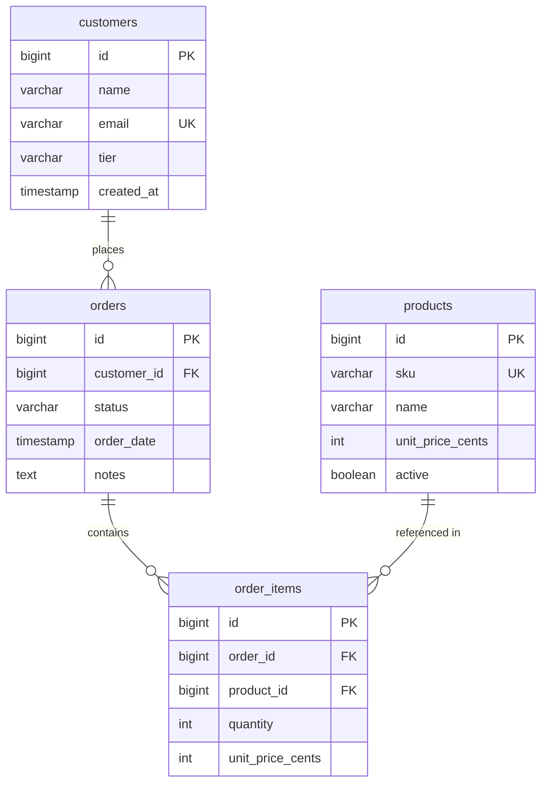

# Data Mapping

## Data Mapping: Orders View

This story is read-only — it does not introduce new tables. It reads from three existing tables defined in the Data Migration decision: `orders`, `customers`, and `order_items`. The `products` table is not needed for the order list view (prices are snapshotted in `order_items.unit_price_cents`).

### Target PostgreSQL Schema (relevant tables)

### Column Mapping (Legacy → Target)

| Legacy (MySQL/JSON) | Target (PostgreSQL JPA) | Type Change | Notes |
|---|---|---|---|
| `orders.id` INT unsigned AUTO_INCREMENT | `Order.id` BIGSERIAL | INT → BIGINT | Standard JPA `@GeneratedValue(IDENTITY)` |
| `orders.customer_id` INT unsigned | `Order.customerId` BIGINT | INT → BIGINT | FK to customers |
| `orders.status` ENUM('new','paid','shipped','cancelled') | `Order.status` VARCHAR(20) | ENUM → VARCHAR | Validated in Java, not DB enum. Default `'new'` |
| `orders.order_date` DATETIME | `Order.orderDate` TIMESTAMP | DATETIME → TIMESTAMP | PostgreSQL `TIMESTAMP WITHOUT TIME ZONE` |
| `orders.notes` TEXT | `Order.notes` TEXT | No change | Nullable |
| `customers.name` VARCHAR(120) | `Customer.name` VARCHAR(120) | No change | |
| `customers.email` VARCHAR(255) | `Customer.email` VARCHAR(255) | No change | Unique constraint preserved |
| `order_items.quantity` INT unsigned | `OrderItem.quantity` INT | Unsigned → signed | Java int, validated ≥ 1 |
| `order_items.unit_price_cents` INT unsigned | `OrderItem.unitPriceCents` INT | Unsigned → signed | Snapshotted price at order time |

### Key Decisions
- **No `order_totals` view** — totals computed via JPQL JOIN + SUM in the repository query.
- **Status as VARCHAR, not DB enum** — avoids PostgreSQL enum migration hassle; validated in Java code.
- **Integer cents** preserved for monetary values per the locked Data Migration decision.
- **BIGINT IDs** — idiomatic for JPA/PostgreSQL even though the legacy uses INT.
