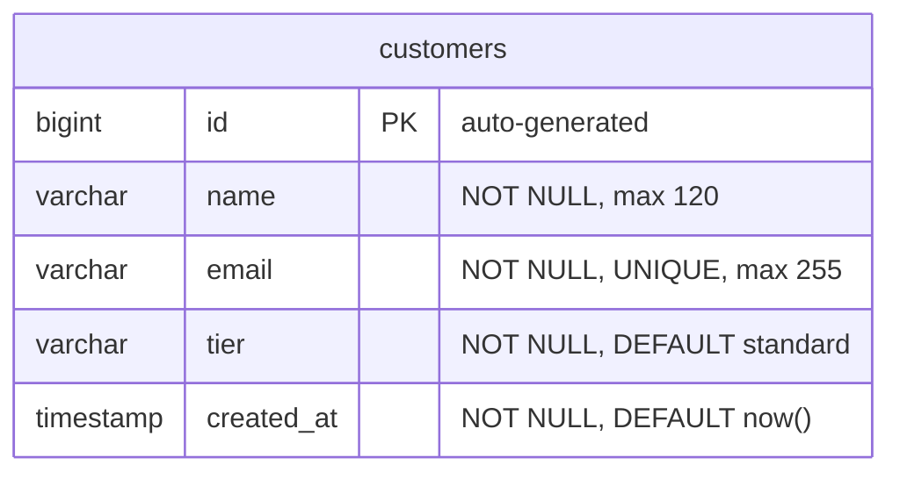

# Locked Decisions for Story 6e5ab65a-c358-4df5-8042-e5c4ef2ad09f

## Implementation Approach
## Implementation Approach: Standard Spring Boot CRUD + Next.js Page

### Backend (Spring Boot)

Follow the locked layered architecture exactly:

| Layer | Class | Responsibility |
|-------|-------|----------------|
| Controller | `CustomerController` | `GET /api/customers`, `POST /api/customers` — validation, HTTP status codes, DTO mapping |
| Service | `CustomerService` | Business logic — duplicate email check, default tier assignment |
| Repository | `CustomerRepository` | `JpaRepository<Customer, Long>` — `findAllByOrderByCreatedAtDesc()`, `existsByEmail(String)` |
| Entity | `Customer` | JPA entity with Lombok annotations (`@Data`, `@Builder`, `@NoArgsConstructor`, `@AllArgsConstructor`) |
| DTOs | `CreateCustomerRequest` (record), `CustomerResponse` (record) | Decouple API contract from entity |

### API Endpoints

**`GET /api/customers`**
- Returns `{ "customers": [...] }` — array of all customers sorted by `created_at` DESC
- Each customer includes: `id`, `name`, `email`, `tier`, `createdAt`
- Matches legacy response shape exactly

**`POST /api/customers`**
- Request body: `{ "name": "...", "email": "...", "tier": "..." }` — tier is optional (defaults to `"standard"`)
- Success: `201 Created` with `{ "customer": { id, name, email, tier, createdAt } }`
- Validation failure: `400 Bad Request` with `{ "error": "..." }`
- Duplicate email: `409 Conflict` with `{ "error": "A customer with this email already exists" }`

### Frontend (Next.js)

A dedicated `/customers` route with a single `'use client'` page component containing:
- **Registration form** — name (text input), email (email input), tier (select dropdown), submit button
- **Customer table** — displays all customers sorted by most recently created, showing name, email, and tier badge
- Data fetching via `fetch('/api/customers')` with `useState`/`useEffect`
- Form submission via `fetch('/api/customers', { method: 'POST' })` — on success, refresh the list; on error, display the backend error message

### Flyway Migration

A single `V1__create_customers_table.sql` migration to create the `customers` table in PostgreSQL. This is the foundational migration — other stories will add subsequent versioned migrations.

### Seed Data

Flyway `V1.1__seed_customers.sql` (or `afterMigrate` callback) inserts the 3 legacy demo customers (Ava Chen, Noah Singh, Maya Patel) so the app is immediately usable after startup.

### Key Decisions
- **Duplicate email handling**: Check at the service layer via `existsByEmail()` before insert, and also enforce via DB unique constraint. Return `409 Conflict` (the legacy app relies on the DB constraint silently; the target should return a clear error).
- **Tier enum**: Model as a Java `enum` (`STANDARD`, `PREMIUM`, `ENTERPRISE`) with `@Enumerated(EnumType.STRING)` on the entity. Stored as lowercase string in PostgreSQL to match legacy data.
- **ID generation**: Use `@GeneratedValue(strategy = GenerationType.IDENTITY)` with PostgreSQL `BIGSERIAL` — auto-incrementing IDs matching legacy behavior.
- **Timestamps**: Use `@CreationTimestamp` with `LocalDateTime` / PostgreSQL `TIMESTAMP`.

## Data Mapping
## Data Mapping: Legacy customers → PostgreSQL customers

### Target Table (PostgreSQL via Flyway)



### Column Mapping

| Legacy Column | Legacy Type | Target Column | Target Type | Notes |
|---------------|------------|---------------|-------------|-------|
| `id` | `INT unsigned` / `INTEGER AUTOINCREMENT` | `id` | `BIGSERIAL PRIMARY KEY` | Auto-incrementing, widens to bigint for safety |
| `name` | `VARCHAR(120)` / `TEXT NOT NULL` | `name` | `VARCHAR(120) NOT NULL` | No change |
| `email` | `VARCHAR(255)` / `TEXT NOT NULL UNIQUE` | `email` | `VARCHAR(255) NOT NULL UNIQUE` | Unique constraint preserved |
| `tier` | `ENUM('standard','premium','enterprise')` | `tier` | `VARCHAR(20) NOT NULL DEFAULT 'standard'` | Store as lowercase string + CHECK constraint instead of ENUM type for portability |
| `created_at` | `DATETIME` / `TEXT` | `created_at` | `TIMESTAMP NOT NULL DEFAULT NOW()` | PostgreSQL native timestamp |

### DDL (Flyway V1)

```sql
CREATE TABLE customers (
    id         BIGSERIAL PRIMARY KEY,
    name       VARCHAR(120) NOT NULL,
    email      VARCHAR(255) NOT NULL,
    tier       VARCHAR(20)  NOT NULL DEFAULT 'standard',
    created_at TIMESTAMP    NOT NULL DEFAULT NOW(),
    CONSTRAINT uk_customers_email CHECK (email IS NOT NULL),
    CONSTRAINT uq_customers_email UNIQUE (email),
    CONSTRAINT chk_customers_tier CHECK (tier IN ('standard', 'premium', 'enterprise'))
);
```

### Seed Data (3 legacy demo customers)

```sql
INSERT INTO customers (id, name, email, tier, created_at) VALUES
  (1, 'Ava Chen',   'ava@example.com',  'premium',    '2026-01-04 09:00:00'),
  (2, 'Noah Singh', 'noah@example.com', 'standard',   '2026-01-08 10:30:00'),
  (3, 'Maya Patel', 'maya@example.com', 'enterprise', '2026-01-10 13:15:00');

SELECT setval('customers_id_seq', (SELECT MAX(id) FROM customers));
```

The `setval` call ensures the sequence continues from the correct position after seeding with explicit IDs.

### Key Decisions
- **VARCHAR(20) + CHECK** over PostgreSQL `ENUM` type — easier to extend without a migration, JPA maps cleanly to a Java enum via `@Enumerated(EnumType.STRING)`
- **BIGSERIAL** over `SERIAL` — standard practice for new PostgreSQL tables, negligible overhead, avoids future integer overflow
- **No schema changes** — the customers table structure is a 1:1 mapping from legacy; no columns added, removed, or renamed
- **Destination is empty** — this is the first migration; no existing tables to integrate with

## UI/UX
## UI/UX: Dedicated Customers Page

### Layout

**App shell**: Sidebar navigation (fixed left, ~224px) + scrollable main content area. This establishes the navigation pattern for all stories.

**Sidebar nav items** (sets the pattern for the whole app):
- Dashboard (future)
- **Customers** (this story — active/highlighted)
- Products (future)
- Orders (future)
- Revenue (future)

**Customers page** (`/customers`) has two stacked cards:

1. **Registration form card** — "Register New Customer" header, 3-column grid on desktop (name, email, tier select), "Add Customer" button aligned right
2. **Customer list card** — "All Customers" header with count badge, full-width table with columns: Name, Email, Tier (badge), Registered (formatted date)

### Component Breakdown

| Component | Description |
|-----------|-------------|
| `AppLayout` | Sidebar + main content shell — reused by every page |
| `Sidebar` / `NavLink` | Navigation with active state highlighting |
| `CustomerForm` | Controlled form with name, email, tier inputs + submit |
| `CustomerTable` | Table displaying customer list with tier badges |
| `TierBadge` | Small colored badge — gray for Standard, amber for Premium, purple for Enterprise |
| `ErrorBanner` | Dismissible red banner above the form for backend validation errors |

### Interaction Flow

1. Page loads → `useEffect` fetches `GET /api/customers` → populates table
2. User fills form → clicks "Add Customer" → `POST /api/customers`
3. **Success (201)**: form resets, customer list re-fetches, new customer appears at top
4. **Error (400/409)**: red error banner appears above the form with the backend's error message; clears on next input change
5. Tier defaults to "Standard" (pre-selected in dropdown) — user can change it

### Visual Design

- **Colors**: Blue brand palette (600 primary, 50 for active nav backgrounds), slate/gray surface tones
- **Cards**: White background, rounded-xl, subtle border + shadow-sm
- **Table rows**: Hover highlight, comfortable padding (py-3.5)
- **Tier badges**: Distinct colors per tier — gray-100/gray-700 (Standard), amber-50/amber-700 (Premium), purple-50/purple-700 (Enterprise)
- **Typography**: Inter/system font stack, 2xl bold page title, xs uppercase table headers
- **Transitions**: 150ms on all interactive elements

### Responsive Behavior
- Form grid collapses from 3 columns to 1 on small screens (`grid-cols-1 sm:grid-cols-3`)
- Sidebar remains fixed (acceptable for internal desktop tool)
- Table scrolls horizontally if needed on very narrow viewports
Artifacts: `artifacts/customers_page_prototype.html`

## Validation
## Validation: Customer Registration Rules

### Backend Validation (Spring Boot)

**Request DTO — `CreateCustomerRequest`** (Java record with Jakarta Bean Validation):

| Field | Annotation | Rule | Error Message |
|-------|-----------|------|---------------|
| `name` | `@NotBlank` | Required, non-empty after trim | `"name is required"` |
| `email` | `@NotBlank`, `@Email` | Required, valid email format | `"email is required"` / `"must be a valid email address"` |
| `tier` | (nullable) | Optional — defaults to `"standard"` if null/absent | — |

**Business Rules (Service Layer)**:

| Rule | Check | HTTP Response |
|------|-------|---------------|
| Duplicate email | `customerRepository.existsByEmail(email)` | `409 Conflict` — `{ "error": "A customer with this email already exists" }` |
| Invalid tier value | Java enum deserialization fails OR explicit check | `400 Bad Request` — `{ "error": "tier must be one of: standard, premium, enterprise" }` |

**Database Constraints (Defense in Depth)**:
- `UNIQUE(email)` — catches any race condition the service-layer check misses
- `CHECK(tier IN ('standard', 'premium', 'enterprise'))` — final guard on tier values
- `NOT NULL` on name, email, tier, created_at

### Frontend Validation (Next.js)

**Client-side (immediate feedback)**:
- Name field: `required` attribute — browser prevents empty submission
- Email field: `required` + `type="email"` — browser checks basic format
- Tier field: pre-selected to "Standard" — cannot be blank

**Server error display**:
- On `400`/`409` response, parse the JSON `error` field and display it as an inline error message above the form
- Clear the error on the next form input change
- Do NOT duplicate complex business validation (like email uniqueness) on the client — let the backend be the source of truth

### Error Response Format

All validation errors return a consistent JSON shape:
```json
{
  "error": "human-readable message"
}
```

This matches the legacy API's error format (`res.status(400).json({ error: '...' })`), keeping the frontend integration simple.

### Edge Cases
- **Whitespace-only name**: `@NotBlank` rejects it (unlike `@NotNull` which would allow it)
- **Case sensitivity on email**: Store emails as-is (no lowercasing) — matches legacy behavior. The unique constraint is case-sensitive by default in PostgreSQL; this is acceptable for an internal tool
- **Leading/trailing whitespace on email**: Trim in the service layer before persistence to avoid accidental duplicates like `"ava@example.com"` vs `"ava@example.com "`
