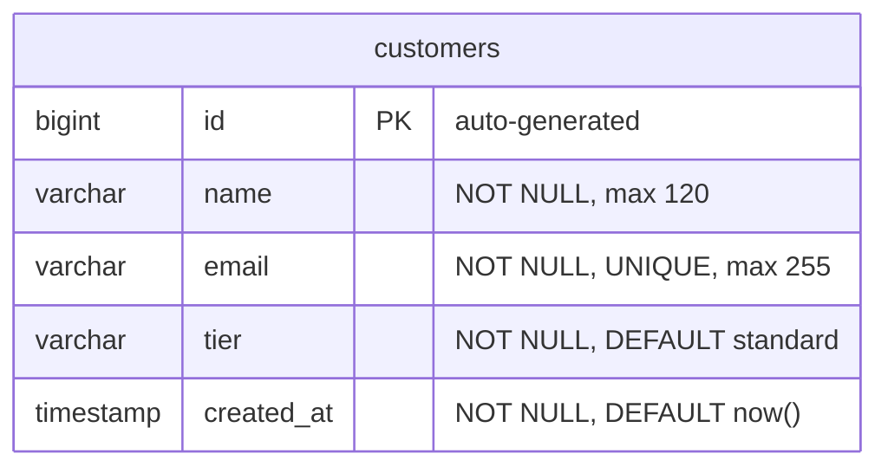

# Data Mapping

## Data Mapping: Legacy customers → PostgreSQL customers

### Target Table (PostgreSQL via Flyway)



### Column Mapping

| Legacy Column | Legacy Type | Target Column | Target Type | Notes |
|---------------|------------|---------------|-------------|-------|
| `id` | `INT unsigned` / `INTEGER AUTOINCREMENT` | `id` | `BIGSERIAL PRIMARY KEY` | Auto-incrementing, widens to bigint for safety |
| `name` | `VARCHAR(120)` / `TEXT NOT NULL` | `name` | `VARCHAR(120) NOT NULL` | No change |
| `email` | `VARCHAR(255)` / `TEXT NOT NULL UNIQUE` | `email` | `VARCHAR(255) NOT NULL UNIQUE` | Unique constraint preserved |
| `tier` | `ENUM('standard','premium','enterprise')` | `tier` | `VARCHAR(20) NOT NULL DEFAULT 'standard'` | Store as lowercase string + CHECK constraint instead of ENUM type for portability |
| `created_at` | `DATETIME` / `TEXT` | `created_at` | `TIMESTAMP NOT NULL DEFAULT NOW()` | PostgreSQL native timestamp |

### DDL (Flyway V1)

```sql
CREATE TABLE customers (
    id         BIGSERIAL PRIMARY KEY,
    name       VARCHAR(120) NOT NULL,
    email      VARCHAR(255) NOT NULL,
    tier       VARCHAR(20)  NOT NULL DEFAULT 'standard',
    created_at TIMESTAMP    NOT NULL DEFAULT NOW(),
    CONSTRAINT uk_customers_email CHECK (email IS NOT NULL),
    CONSTRAINT uq_customers_email UNIQUE (email),
    CONSTRAINT chk_customers_tier CHECK (tier IN ('standard', 'premium', 'enterprise'))
);
```

### Seed Data (3 legacy demo customers)

```sql
INSERT INTO customers (id, name, email, tier, created_at) VALUES
  (1, 'Ava Chen',   'ava@example.com',  'premium',    '2026-01-04 09:00:00'),
  (2, 'Noah Singh', 'noah@example.com', 'standard',   '2026-01-08 10:30:00'),
  (3, 'Maya Patel', 'maya@example.com', 'enterprise', '2026-01-10 13:15:00');

SELECT setval('customers_id_seq', (SELECT MAX(id) FROM customers));
```

The `setval` call ensures the sequence continues from the correct position after seeding with explicit IDs.

### Key Decisions
- **VARCHAR(20) + CHECK** over PostgreSQL `ENUM` type — easier to extend without a migration, JPA maps cleanly to a Java enum via `@Enumerated(EnumType.STRING)`
- **BIGSERIAL** over `SERIAL` — standard practice for new PostgreSQL tables, negligible overhead, avoids future integer overflow
- **No schema changes** — the customers table structure is a 1:1 mapping from legacy; no columns added, removed, or renamed
- **Destination is empty** — this is the first migration; no existing tables to integrate with
