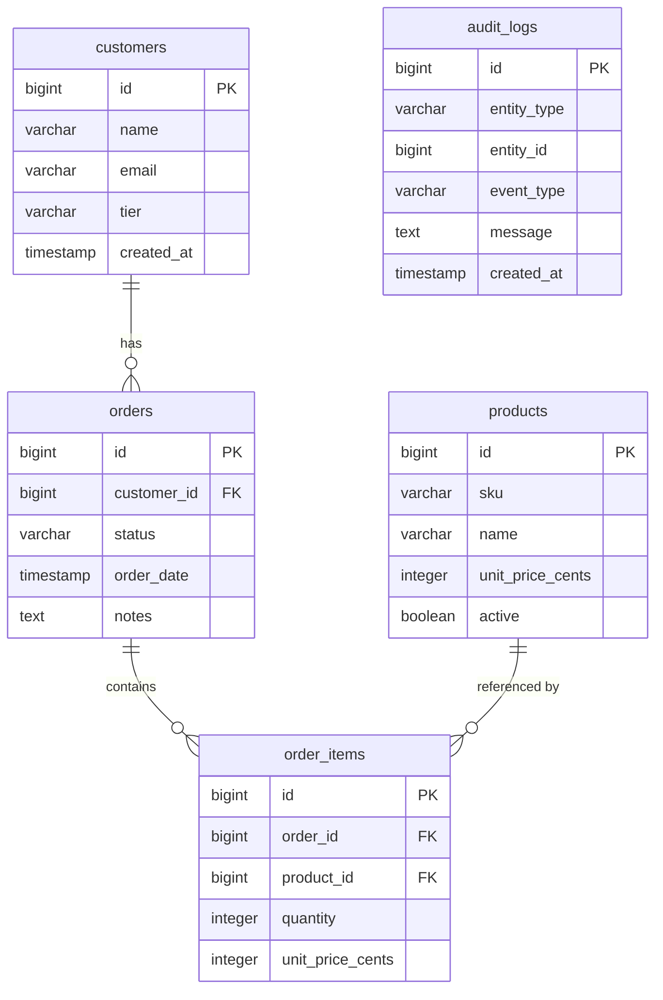

# Locked Decisions for Story 817a5726-9f73-46a9-a1bc-97cacb42245e

## Implementation Approach
## Implementation Approach: Transactional Order Creation with Audit Logging

### Service Layer Pattern
The `OrderService.createOrder()` method handles the full workflow in a single `@Transactional` method:

1. **Validate inputs** — reject if `customerId` is null/missing or `items` is empty
2. **Verify customer** — load customer by ID; throw `ResponseStatusException(404)` if not found
3. **Create order** — persist `Order` entity with status `'new'`, current timestamp, and optional notes
4. **Process line items** — iterate submitted items:
   - Look up each product by ID where `active = true`
   - Skip silently if product not found or inactive
   - Snapshot `unitPriceCents` from the product into the `OrderItem`
5. **Post-validation** — if zero valid items survived filtering, roll back and return 400 error
6. **Audit log** — insert `AuditLog` with `entityType='order'`, `eventType='created'`, and a message
7. **Return full order** — respond with the created order including its accepted line items and a list of any skipped product IDs

### Key Design Choices
- **Single transaction** — order, items, and audit log are written atomically via `@Transactional`
- **Audit logging inline** — the audit log insert lives in `OrderService`, not in a separate event listener. This keeps it simple and transactional (no risk of the audit log missing if a listener fails)
- **Price snapshot at creation** — `unitPriceCents` is copied from `products.unit_price_cents` into `order_items.unit_price_cents` at insert time, never referenced live
- **No cascading deletes** — orders are never deleted, only status-transitioned

### Layer Responsibilities
| Layer | Class | Responsibility |
|-------|-------|---------------|
| Controller | `OrderController` | Parse request body, validate via `@Valid`, call service, shape response |
| Service | `OrderService` | Business logic: customer lookup, product filtering, price snapshot, audit |
| Repository | `OrderRepository`, `OrderItemRepository`, `AuditLogRepository` | Spring Data JPA interfaces |
| DTO | `CreateOrderRequest` (record), `OrderResponse` (record) | Request/response shapes |
| Entity | `Order`, `OrderItem`, `AuditLog` | JPA entities with Lombok |


## Data Mapping
## Data Mapping: Legacy MySQL → Target PostgreSQL

### Target Schema
The target project is empty — no existing migrations or entities. All five tables are created fresh via Flyway, preserving the legacy structure with PostgreSQL-idiomatic types.



### Column Mapping (Legacy → Target)

| Legacy Table | Legacy Column | Legacy Type | Target Table | Target Column | Target Type | Notes |
|---|---|---|---|---|---|---|
| orders | id | INT unsigned AUTO_INCREMENT | orders | id | BIGSERIAL | PG auto-increment |
| orders | customer_id | INT unsigned | orders | customer_id | BIGINT NOT NULL | FK → customers.id |
| orders | status | ENUM('new','paid','shipped','cancelled') | orders | status | VARCHAR(20) NOT NULL DEFAULT 'new' | CHECK constraint instead of ENUM |
| orders | order_date | DATETIME DEFAULT CURRENT_TIMESTAMP | orders | order_date | TIMESTAMP NOT NULL DEFAULT now() | PG timestamp |
| orders | notes | TEXT | orders | notes | TEXT | Nullable |
| order_items | id | INT unsigned AUTO_INCREMENT | order_items | id | BIGSERIAL | PG auto-increment |
| order_items | order_id | INT unsigned | order_items | order_id | BIGINT NOT NULL | FK → orders.id |
| order_items | product_id | INT unsigned | order_items | product_id | BIGINT NOT NULL | FK → products.id |
| order_items | quantity | INT unsigned | order_items | quantity | INTEGER NOT NULL | CHECK(quantity > 0) |
| order_items | unit_price_cents | INT unsigned | order_items | unit_price_cents | INTEGER NOT NULL | Snapshotted at order time |
| audit_logs | id | INT unsigned AUTO_INCREMENT | audit_logs | id | BIGSERIAL | PG auto-increment |
| audit_logs | entity_type | VARCHAR(80) | audit_logs | entity_type | VARCHAR(80) NOT NULL | e.g. 'order' |
| audit_logs | entity_id | INT unsigned | audit_logs | entity_id | BIGINT NOT NULL | Polymorphic ref |
| audit_logs | event_type | VARCHAR(80) | audit_logs | event_type | VARCHAR(80) NOT NULL | e.g. 'created' |
| audit_logs | message | TEXT | audit_logs | message | TEXT NOT NULL | |
| audit_logs | created_at | DATETIME DEFAULT CURRENT_TIMESTAMP | audit_logs | created_at | TIMESTAMP NOT NULL DEFAULT now() | |

### Key Type Changes
- `INT unsigned` → `BIGINT` / `BIGSERIAL` (future-proof IDs)
- `ENUM` → `VARCHAR` + `CHECK` constraint (more flexible in PostgreSQL)
- `TINYINT(1)` → `BOOLEAN` (idiomatic PG)
- `DATETIME` → `TIMESTAMP` (PG standard)

### Indexes Preserved
- `idx_orders_customer_id` on `orders(customer_id)`
- `idx_order_items_order_id` on `order_items(order_id)`
- `idx_order_items_product_id` on `order_items(product_id)`
- `idx_audit_logs_entity` on `audit_logs(entity_type, entity_id)`
- `uk_products_sku` unique on `products(sku)`
- `uk_customers_email` unique on `customers(email)`


## UI/UX
## UI/UX: Slide-Out Panel Order Creation on Orders Page

### Design System
Matches the legacy warm earthy palette:
- Brand green `#245f4f`, orange accent `#d36b37`, beige background `#f6f3ed`
- Font: Inter, border-radius: 28px panels / 18px items / 14px inputs
- Status badges: blue (new), green (paid), amber (shipped), red (cancelled)

### Order Creation Flow
1. **Trigger** — "New Order" button in the orders page toolbar (next to the status filter) opens a **slide-out panel from the right** with a blurred backdrop
2. **Customer selection** — dropdown populated from `GET /api/customers`, showing name, email, and tier
3. **Dynamic line items** — each row is a 3-column grid: product dropdown (name + formatted price), quantity input (`min=1`), and a remove button. An "Add item" dashed button appends new rows. At least one row is always visible.
4. **Notes** — optional textarea below the line items
5. **Running total** — a summary bar below the form shows the estimated total (computed client-side as `sum of quantity × unitPriceCents / 100` for selected products) with an item count. Labeled "Estimated total" since the server confirms the final price.
6. **Submit** — "Create Order" button POSTs to `/api/orders`, "Cancel" closes the panel

### Post-Submission Feedback
- **Success** — panel closes, a green banner slides down at the top of the orders list: "Order #N created successfully". The orders list refreshes to show the new order at the top. Banner auto-dismisses after 5 seconds.
- **Skipped items warning** — if `skippedProductIds` is non-empty, an orange warning banner appears alongside the success banner: "N item(s) skipped — [product names] are no longer active"
- **Validation error** — inline red error box within the panel (e.g., "Please select a customer"). Panel stays open so the user can fix the issue.
- **Server error** — inline error in panel showing the server's error message

### Components to Build
| Component | Purpose |
|-----------|---------|
| `OrderSlidePanel` | The slide-out panel container with backdrop, open/close state |
| `CreateOrderForm` | Form content: customer select, line items, notes, total, submit |
| `LineItemRow` | Single product-quantity row with remove button |
| `StatusBadge` | Reusable colored pill for order status (used across orders list too) |
| `AlertBanner` | Reusable success/warning/error banner with auto-dismiss |

### Responsive Behavior
- Panel is `min(520px, 100%)` — fills the screen on mobile
- Orders page grid collapses to single column below 800px (matches legacy breakpoint)

Artifacts: `artifacts/create_order___slide_panel_ui.html`

## Validation
## Validation: Input Rules & Edge Cases

### Request-Level Validation (Jakarta Bean Validation on DTOs)
| Field | Rule | Annotation |
|-------|------|-----------|
| `customerId` | Required, non-null | `@NotNull` |
| `items` | Required, at least 1 element | `@NotEmpty` |
| `items[].productId` | Required, non-null | `@NotNull` |
| `items[].quantity` | Required, ≥ 1 | `@NotNull @Min(1)` |
| `notes` | Optional, nullable | No annotation needed |

Jakarta validation failures return `400` with a structured error body before the service layer is reached.

### Business Rule Validation (in OrderService)
| Rule | Behavior |
|------|----------|
| Customer ID doesn't match any row | Return `404` — "Customer not found" |
| Product ID doesn't exist | Skip that line item silently |
| Product exists but `active = false` | Skip that line item silently |
| All submitted items were skipped (zero valid) | Return `400` — "No valid active products found in the submitted items" |
| Duplicate product IDs in items list | Each entry is processed independently (two line items for same product = two rows in `order_items`). This matches legacy behavior. |

### Edge Cases
| Scenario | Handling |
|----------|---------|
| `quantity = 0` or negative | Rejected by `@Min(1)` at the DTO level |
| `items` is `null` | Rejected by `@NotEmpty` |
| `items` is `[]` (empty array) | Rejected by `@NotEmpty` |
| Request body missing entirely | Spring returns `400` (HttpMessageNotReadableException) |
| `notes` is `null` | Stored as null — order created without notes |
| Very large quantity (e.g., 999999) | Allowed — no business cap specified. The `INTEGER` column handles up to ~2.1B |
| `customerId` is valid but customer was soft-deleted | Not applicable — customers table has no soft-delete column in the schema |

### Error Response Format
All validation errors use a consistent shape:
```json
{ "error": "Human-readable message describing what went wrong" }
```
This matches the legacy pattern (`res.status(400).json({ error: '...' })`).


## API Design
## API Design: POST /api/orders

### Endpoint
`POST /api/orders` — creates a new order with line items and optional notes.

### Request Body
```json
{
  "customerId": 1,
  "notes": "Priority customer",
  "items": [
    { "productId": 1, "quantity": 2 },
    { "productId": 3, "quantity": 1 }
  ]
}
```

### Success Response — `201 Created`
Returns the full created order, its accepted line items, and any skipped product IDs:
```json
{
  "order": {
    "id": 4,
    "customerId": 1,
    "customerName": "Ava Chen",
    "status": "new",
    "orderDate": "2026-07-30T14:22:00Z",
    "notes": "Priority customer",
    "items": [
      { "id": 6, "productId": 1, "productName": "Planning Board", "quantity": 2, "unitPriceCents": 2499 },
      { "id": 7, "productId": 3, "productName": "Ergo Chair", "quantity": 1, "unitPriceCents": 18999 }
    ],
    "totalCents": 23997
  },
  "skippedProductIds": []
}
```

### Error Responses
| Status | Condition | Body |
|--------|-----------|------|
| `400` | Missing `customerId` or empty `items` array | `{ "error": "customerId and at least one item are required" }` |
| `400` | All submitted items reference inactive/missing products | `{ "error": "No valid active products found in the submitted items" }` |
| `404` | `customerId` doesn't match any customer | `{ "error": "Customer not found" }` |

### Request DTO (Java record)
```java
public record CreateOrderRequest(
    @NotNull Long customerId,
    @NotEmpty List<OrderItemRequest> items,
    String notes
) {}

public record OrderItemRequest(
    @NotNull Long productId,
    @NotNull @Min(1) Integer quantity
) {}
```

### Design Notes
- Matches the legacy `POST /api/orders` path exactly
- Enriches the response beyond legacy (which returned just `{ orderId }`) to include full order details per the agreed approach
- `skippedProductIds` enables the frontend to show a warning when items were silently dropped
- `totalCents` is computed server-side as the sum of `quantity * unitPriceCents` across accepted items


## API Design

