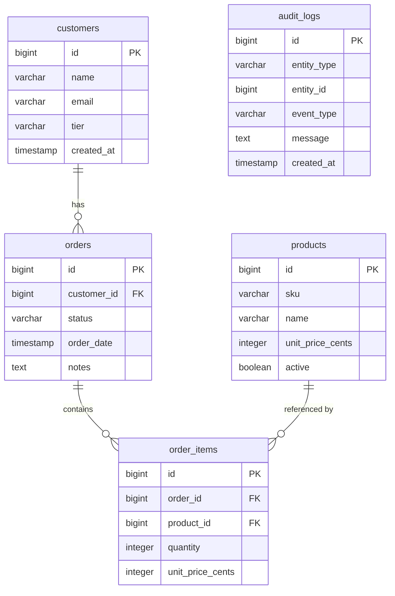

# Data Mapping

## Data Mapping: Legacy MySQL → Target PostgreSQL

### Target Schema
The target project is empty — no existing migrations or entities. All five tables are created fresh via Flyway, preserving the legacy structure with PostgreSQL-idiomatic types.

### Column Mapping (Legacy → Target)

| Legacy Table | Legacy Column | Legacy Type | Target Table | Target Column | Target Type | Notes |
|---|---|---|---|---|---|---|
| orders | id | INT unsigned AUTO_INCREMENT | orders | id | BIGSERIAL | PG auto-increment |
| orders | customer_id | INT unsigned | orders | customer_id | BIGINT NOT NULL | FK → customers.id |
| orders | status | ENUM('new','paid','shipped','cancelled') | orders | status | VARCHAR(20) NOT NULL DEFAULT 'new' | CHECK constraint instead of ENUM |
| orders | order_date | DATETIME DEFAULT CURRENT_TIMESTAMP | orders | order_date | TIMESTAMP NOT NULL DEFAULT now() | PG timestamp |
| orders | notes | TEXT | orders | notes | TEXT | Nullable |
| order_items | id | INT unsigned AUTO_INCREMENT | order_items | id | BIGSERIAL | PG auto-increment |
| order_items | order_id | INT unsigned | order_items | order_id | BIGINT NOT NULL | FK → orders.id |
| order_items | product_id | INT unsigned | order_items | product_id | BIGINT NOT NULL | FK → products.id |
| order_items | quantity | INT unsigned | order_items | quantity | INTEGER NOT NULL | CHECK(quantity > 0) |
| order_items | unit_price_cents | INT unsigned | order_items | unit_price_cents | INTEGER NOT NULL | Snapshotted at order time |
| audit_logs | id | INT unsigned AUTO_INCREMENT | audit_logs | id | BIGSERIAL | PG auto-increment |
| audit_logs | entity_type | VARCHAR(80) | audit_logs | entity_type | VARCHAR(80) NOT NULL | e.g. 'order' |
| audit_logs | entity_id | INT unsigned | audit_logs | entity_id | BIGINT NOT NULL | Polymorphic ref |
| audit_logs | event_type | VARCHAR(80) | audit_logs | event_type | VARCHAR(80) NOT NULL | e.g. 'created' |
| audit_logs | message | TEXT | audit_logs | message | TEXT NOT NULL | |
| audit_logs | created_at | DATETIME DEFAULT CURRENT_TIMESTAMP | audit_logs | created_at | TIMESTAMP NOT NULL DEFAULT now() | |

### Key Type Changes
- `INT unsigned` → `BIGINT` / `BIGSERIAL` (future-proof IDs)
- `ENUM` → `VARCHAR` + `CHECK` constraint (more flexible in PostgreSQL)
- `TINYINT(1)` → `BOOLEAN` (idiomatic PG)
- `DATETIME` → `TIMESTAMP` (PG standard)

### Indexes Preserved
- `idx_orders_customer_id` on `orders(customer_id)`
- `idx_order_items_order_id` on `order_items(order_id)`
- `idx_order_items_product_id` on `order_items(product_id)`
- `idx_audit_logs_entity` on `audit_logs(entity_type, entity_id)`
- `uk_products_sku` unique on `products(sku)`
- `uk_customers_email` unique on `customers(email)`

