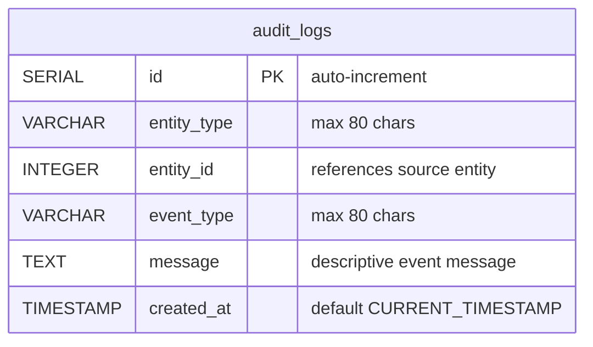

# Locked Decisions for Story bc5ff862-b980-479f-ba42-62ba21000f43

## Implementation Approach
## Implementation Approach: Layered Read Endpoint + Service-Level Audit Writing

### Backend Layers

**JPA Entity** — `AuditLog` in `model/` with Lombok annotations (`@Entity`, `@Data`, `@NoArgsConstructor`, `@AllArgsConstructor`, `@Builder`). Maps directly to the `audit_logs` table.

**Repository** — `AuditLogRepository` extends `JpaRepository<AuditLog, Long>`. Provides:
- `List<AuditLog> findTop50ByOrderByCreatedAtDesc()` — single derived query method satisfying the "most recent 50" requirement from AC #4

**Service** — `AuditLogService` with two responsibilities:
- `getRecentAuditLogs()` — delegates to the repository's top-50 query
- `logEvent(entityType, entityId, eventType, message)` — creates and persists a new audit entry. Called by `OrderService` during order creation (AC #2) and status updates (AC #3)

**Controller** — `AuditLogController` with a single endpoint:
- `GET /api/audit-logs` → returns `{ "auditLogs": [...] }`
- Matches the legacy response shape exactly

**DTO** — `AuditLogDto` as a Java record:
```java
public record AuditLogDto(
    Long id,
    String entityType,
    Long entityId,
    String eventType,
    String message,
    LocalDateTime createdAt
) {}
```

### Audit Entry Creation Pattern

Audit entries are written synchronously within the same transaction as the triggering operation — matching the legacy behavior where `createOrder` and `updateOrderStatus` append to the audit log inline. No event bus or async mechanism needed for this scale.

- **Order created** → `AuditLogService.logEvent("order", orderId, "created", "Order created from legacy UI")`
- **Status changed** → `AuditLogService.logEvent("order", orderId, "status_changed", "Order moved to {status}")`

### API Contract

| Method | Path | Response | Notes |
|--------|------|----------|-------|
| GET | `/api/audit-logs` | `{ "auditLogs": [...] }` | 50 most recent, descending by `created_at` |

No query parameters, no pagination cursor — the legacy endpoint has none, and the AC specifies a hard cap of 50. This keeps the contract identical to the legacy app.

### JSON Serialization

`createdAt` serialized as ISO-8601 string via Jackson's `JavaTimeModule` (e.g., `"2026-02-01T12:00:01"`). Field names use camelCase in the JSON response (`entityType`, `entityId`, `eventType`, `createdAt`) matching the legacy contract.

## Data Mapping
## Data Mapping: 1:1 Migration of audit_logs

The legacy `audit_logs` table maps directly to PostgreSQL with minimal type conversion. No structural changes — the table design is clean and fits the target stack as-is.

### Target ER Diagram



### Column Mapping (Legacy → Target)

| Legacy Column | Legacy Type | Target Column | Target Type | Notes |
|---------------|-------------|---------------|-------------|-------|
| `id` | INT unsigned AUTO_INCREMENT | `id` | SERIAL (INTEGER) | PG SERIAL replaces MySQL unsigned auto-increment |
| `entity_type` | VARCHAR(80) | `entity_type` | VARCHAR(80) | No change |
| `entity_id` | INT unsigned | `entity_id` | INTEGER | PG has no unsigned; values are positive by convention |
| `event_type` | VARCHAR(80) | `event_type` | VARCHAR(80) | No change |
| `message` | TEXT | `message` | TEXT | No change |
| `created_at` | DATETIME DEFAULT CURRENT_TIMESTAMP | `created_at` | TIMESTAMP NOT NULL DEFAULT CURRENT_TIMESTAMP | MySQL DATETIME → PG TIMESTAMP |

### Index

Preserve the composite index `idx_audit_logs_entity` on `(entity_type, entity_id)` — useful for future per-entity audit lookups even though this story only uses the `created_at` ordering.

### Flyway Migration

Created as part of the shared schema migration (all 5 tables in one Flyway script). The `audit_logs` table has **no foreign keys** — `entity_id` is a logical reference, not enforced at the DB level, matching the legacy design. This is intentional: audit logs reference entities by type+ID without coupling to specific tables.

### Seed Data (3 rows, matching legacy)

| id | entity_type | entity_id | event_type | message | created_at |
|----|-------------|-----------|------------|---------|------------|
| 1 | order | 1 | created | Order imported from legacy desk | 2026-02-01T12:00:01Z |
| 2 | order | 1 | status_changed | Order moved to paid | 2026-02-01T12:05:00Z |
| 3 | order | 3 | status_changed | Order shipped from warehouse | 2026-02-04T08:30:00Z |

## UI/UX
## UI/UX: Dedicated Audit Trail Page

### Page Location
- Route: `/audit` in the Next.js app router
- Navigation: "Audit Trail" link in the top navigation bar alongside Dashboard, Orders, Customers, Products

### Layout
Standard full-width table view inside the app's shared layout (top nav + content area). No sidebar, no filters — the audit log is a simple read-only list.

### Table Columns (matching AC #1)

| Column | Source Field | Display |
|--------|-------------|---------|
| Timestamp | `createdAt` | Two-line: date on top (e.g., "Feb 4, 2026"), time below (e.g., "08:30:00") |
| Entity Type | `entityType` | Gray pill badge (e.g., "order") |
| Entity ID | `entityId` | Monospace with # prefix (e.g., "#3") |
| Event | `eventType` | Color-coded badge — green for `created`, blue for `status_changed` |
| Message | `message` | Plain text |

### Visual Design
- White card with subtle border and shadow containing the table
- Light gray header row with uppercase column labels
- Hover highlight on rows for scanability
- Entry count shown below the table ("Showing 3 of 3 entries")
- Responsive — table scrolls horizontally on narrow screens

### Data Fetching
- `'use client'` page component
- `useEffect` calls `fetch('/api/audit-logs')` on mount
- Loading state shows a simple "Loading..." text or skeleton
- Error state shows an inline error message

### No Interactivity Beyond Display
- No filtering, searching, or pagination controls — the API returns a fixed cap of 50 entries sorted by most recent, matching the legacy behavior exactly
- No click-through to order detail (can be added in a future story)

### Components
- **Page component**: `app/audit/page.tsx` — fetches data, renders table
- **Event badge**: Inline styled span with event-type-to-color mapping (small enough to be inline, not a separate component)
- Reuses whatever shared layout/nav component exists from other stories
Artifacts: `artifacts/audit_trail_page.html`
