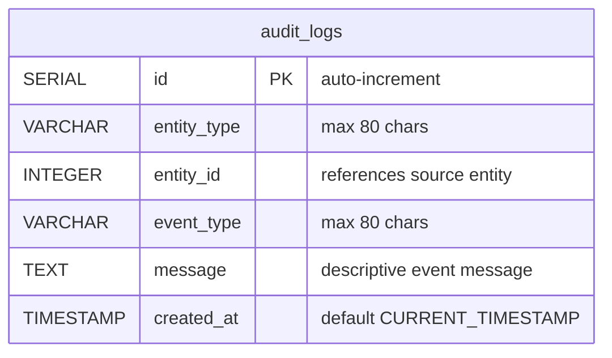

# Data Mapping

## Data Mapping: 1:1 Migration of audit_logs

The legacy `audit_logs` table maps directly to PostgreSQL with minimal type conversion. No structural changes — the table design is clean and fits the target stack as-is.

### Target ER Diagram

### Column Mapping (Legacy → Target)

| Legacy Column | Legacy Type | Target Column | Target Type | Notes |
|---------------|-------------|---------------|-------------|-------|
| `id` | INT unsigned AUTO_INCREMENT | `id` | SERIAL (INTEGER) | PG SERIAL replaces MySQL unsigned auto-increment |
| `entity_type` | VARCHAR(80) | `entity_type` | VARCHAR(80) | No change |
| `entity_id` | INT unsigned | `entity_id` | INTEGER | PG has no unsigned; values are positive by convention |
| `event_type` | VARCHAR(80) | `event_type` | VARCHAR(80) | No change |
| `message` | TEXT | `message` | TEXT | No change |
| `created_at` | DATETIME DEFAULT CURRENT_TIMESTAMP | `created_at` | TIMESTAMP NOT NULL DEFAULT CURRENT_TIMESTAMP | MySQL DATETIME → PG TIMESTAMP |

### Index

Preserve the composite index `idx_audit_logs_entity` on `(entity_type, entity_id)` — useful for future per-entity audit lookups even though this story only uses the `created_at` ordering.

### Flyway Migration

Created as part of the shared schema migration (all 5 tables in one Flyway script). The `audit_logs` table has **no foreign keys** — `entity_id` is a logical reference, not enforced at the DB level, matching the legacy design. This is intentional: audit logs reference entities by type+ID without coupling to specific tables.

### Seed Data (3 rows, matching legacy)

| id | entity_type | entity_id | event_type | message | created_at |
|----|-------------|-----------|------------|---------|------------|
| 1 | order | 1 | created | Order imported from legacy desk | 2026-02-01T12:00:01Z |
| 2 | order | 1 | status_changed | Order moved to paid | 2026-02-01T12:05:00Z |
| 3 | order | 3 | status_changed | Order shipped from warehouse | 2026-02-04T08:30:00Z |
